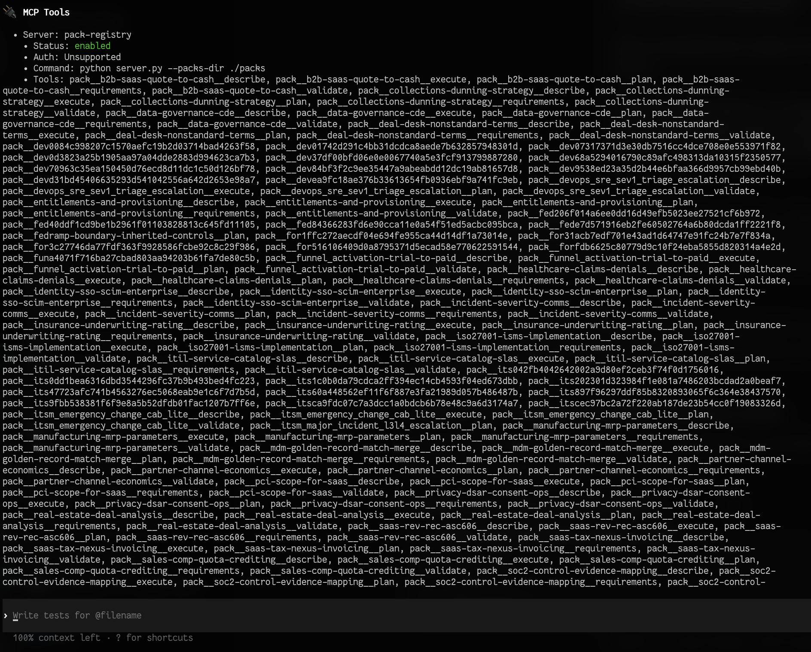

# MCP Tool Heads

Deterministic MCP stdio server that turns every pack into a reusable, structured tool head. Agents can confidently call `pack.<pack_id>.<method>` and receive machine-validated outputs instead of prose.



## Why this exists
- Stable schemas for describe/requirements/plan/execute/validate so clients never have to guess.
- Pure stdio transport via the official `mcp` Python SDK, compatible with Codex MCP and other clients.
- Packs stay self-contained (`pack.json`, JSON Schemas, prompts, examples). Drop in a new directory and the registry auto-loads it.
- Templates produce deterministic plans, procedures, and telemetry so higher-level LLMs can reason over them.

## Quick start
```bash
python -m venv .venv
source .venv/bin/activate
pip install "mcp[cli]"
python server.py --packs-dir ./packs
```

Register it with Codex once:
```bash
codex mcp add pack-registry -- python server.py --packs-dir ./packs
```
Inside the Codex TUI, run `/mcp` to confirm the server is live.

## Pack layout
```
packs/
  quote-to-cash.0.1.0/
    pack.json
    schemas/
      context.schema.json
      output.schema.json
    prompts/
      plan.md
      execute.md
      validate.md
    examples/
      context.minimal.json
      context.full.json
      output.example.json
```

Every pack exports the same tools:
- `pack.<pack_id>.describe`
- `pack.<pack_id>.requirements`
- `pack.<pack_id>.plan`
- `pack.<pack_id>.execute`
- `pack.<pack_id>.validate`

Each tool defines its own `inputSchema` and `outputSchema`, so discovery via `list_tools` and enforcement via `call_tool` work out of the box.

## Development workflow
1. Activate the virtualenv and install `mcp[cli]`.
2. Run `python server.py --packs-dir ./packs`.
3. From another terminal (or your MCP client), issue `call_tool` commands for describe/requirements/plan/execute/validate.
4. Add pack examples under `examples/` so future contributors can replay minimal and full contexts.

When adding a pack, keep prompts deterministic and ASCII-only. Schemas should fail fast on missing required fields so the server can return `needs_context` plus `missing_fields` instead of hallucinating.

## Creating new tool heads
Need a fresh capability? Use the [A9 Tool Head Factory](https://chatgpt.com/g/g-69a2c5cac37c8191a43cf47f3ba15721-a9-mcp-tool-head-factory) to bootstrap prompts and schemas, then drop the pack folder under `packs/`. The loader in `server.py` will register it automatically the next time you start the server.

---
This repo intentionally avoids secrets and keeps configuration via environment variables such as `PACKS_DIR`, `MCP_SERVER_NAME`, and `MCP_SERVER_VERSION`. Keep contributions deterministic so downstream agents can treat every pack as a predictable tool head.
